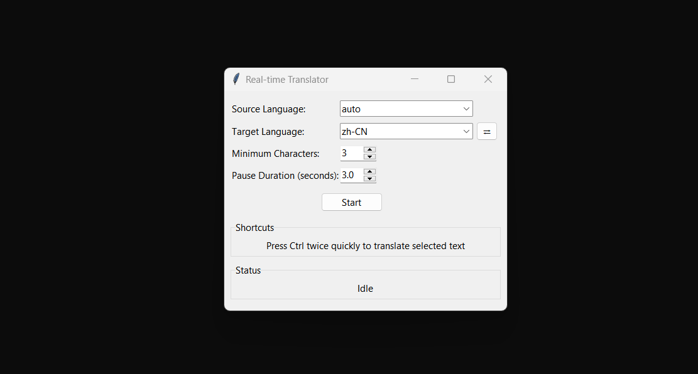
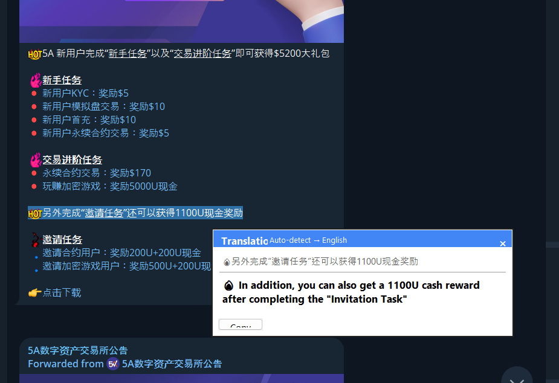

# FluentBridge

  

FluentBridge is a powerful, real-time translation tool that brings down language barriers in your everyday computer use. It provides seamless translation capabilities with a modern, unobtrusive interface.

## Features

- **Real-time translation as you type** - After a brief pause in typing, your text is automatically translated
- **Selection-based translation** - Double-press Ctrl to translate selected text from any application
- **Google-style overlay** - Translations appear in a clean overlay near your cursor
- **Multiple language support** - Translate between numerous languages with auto-detection
- **Clipboard preservation** - Your clipboard contents are preserved throughout the translation process
- **Customizable settings** - Adjust pause duration, minimum character count, and more

## Download and Installation

1. Download the latest release from the [Releases](https://github.com/KiranHayre2/FluentBridge---A-Real-time-Translation-Tool/releases/download/v1.0/FluentBridge.v1.0.exe) page
2. Extract the ZIP file (if applicable)
3. Run FluentBridge.exe

## Usage

1. **Start the application** - Run FluentBridge and click "Start" to begin monitoring
2. **Type anywhere** - As you type in any application, after a brief pause, your text will be translated to the target language
3. **Translate selected text** - Select any text in any application and press Ctrl twice quickly to see a translation overlay
4. **Adjust settings** - Change source/target languages, minimum character count, and pause duration as needed

## Screenshots

  
   
  <em>Main FluentBridge interface</em>

  
   
  <em>Translation overlay that appears when you select text and double-press Ctrl</em>

## License

This project is licensed under the MIT License - see the [LICENSE](LICENSE) file for details.
